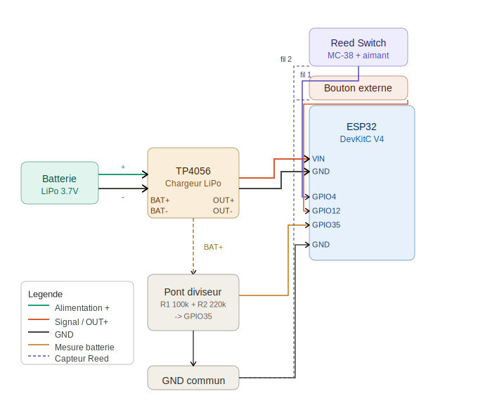
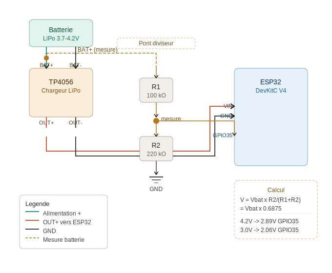
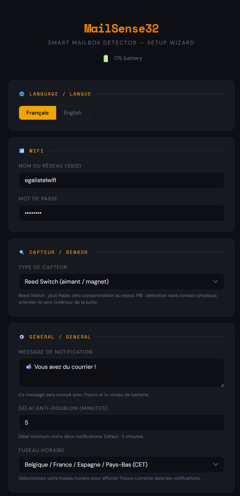
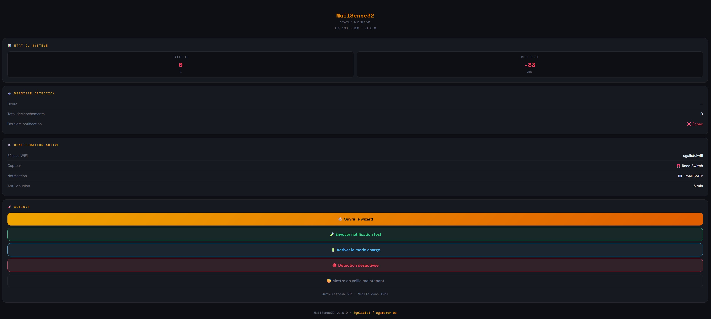
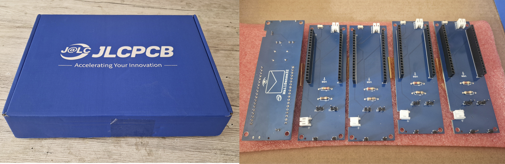

# 📬 MailSense32

<p align="center">
  
</p>

> **Smart Mailbox Detector — Détecteur de courrier intelligent**  
> ESP32 · Deep Sleep · WiFi Wizard · 4 Notification Methods · Open Source

---

[](https://github.com/egalistel-dev/MailSense32)
[](LICENSE)
[](https://www.espressif.com)
[](https://egamaker.be)
[](https://buymeacoffee.com/egalistelw)

---

> 🛒 **Matériel utilisé dans ce projet / Hardware used in this project** : [ESP32-DevKitC sur AliExpress](https://s.click.aliexpress.com/e/_c3s7KU8L) *(lien affilié / affiliate link)*

---

## 🇫🇷 Français | 🇬🇧 [English](#-english)

---

## 🇫🇷 Français

### Présentation

MailSense32 est un détecteur de courrier intelligent basé sur ESP32, conçu pour fonctionner sur batterie pendant **1 à 3 ans** sans intervention.  
L'appareil dort en **deep sleep (~10µA)** et se réveille uniquement à la détection d'un courrier, envoie une notification, puis se rendort immédiatement.

Tout est configurable via un **wizard WiFi embarqué**, sans recompiler le code.

---

### ✨ Fonctionnalités

- 😴 **Deep Sleep ultra-basse consommation** — ~10µA au repos
- 📶 **Wizard WiFi en mode Access Point** — configuration depuis votre téléphone
- 🔍 **2 capteurs supportés** — Reed Switch magnétique ou PIR
- 🔔 **4 méthodes de notification** — Email SMTP, Ntfy.sh, Home Assistant MQTT, Telegram
- 🔋 **Monitoring batterie** — niveau inclus dans chaque notification, alerte < 20%
- 🔋 **Mode charge** — notification automatique quand la batterie atteint 95%
- 📊 **Page de statut locale** — accessible via l'IP locale après chaque réveil
- 🔘 **Bouton externe** — appui court = page de statut, appui long = mode charge
- 🔧 **Mode maintenance** — désactive temporairement la détection pour installation ou maintenance
- 🌍 **Fuseau horaire configurable** — sélection depuis le wizard, heure d'été automatique
- 💬 **Message personnalisable** avec heure de détection
- ⏱️ **Anti-doublon configurable** (délai entre deux notifications, défaut 5 min)
- 🔄 **Reset physique** — bouton BOOT maintenu 3s pour revenir au wizard
- 🧪 **Bouton Test** — testez la notification à tout moment depuis le wizard ou la page de statut
- 🌐 **Interface bilingue FR / EN** — switchable en temps réel

---

### 📋 Matériel requis

| Composant | Détail | Prix indicatif |
|-----------|--------|---------------|
| [ESP32-DevKitC V4](https://s.click.aliexpress.com/e/_c3s7KU8L) | Avec antenne externe IPEX recommandée | ~4€ |
| [Reed Switch MC-38](https://s.click.aliexpress.com/e/_c2R82wxH) | + aimant (souvent inclus) | ~1.17€ |
| [TP4056 Module](https://s.click.aliexpress.com/e/_c4Fs7yE3) | Avec protection batterie intégrée | ~1.33€ |
| [Batterie LiPo 3.7V](https://s.click.aliexpress.com/e/_c3EnN0cJ) | 1000mAh minimum recommandé | ~7.53€ |
| [Résistances 100kΩ + 220kΩ](https://s.click.aliexpress.com/e/_c3FcSUaL) | Pont diviseur batterie | ~0.54€/lot |
| [Bouton poussoir 6x6mm](https://s.click.aliexpress.com/e/_c4tee6WF) | Tactile switch (optionnel) | ~2.32€ |
| [Connecteur JST 2 pins](https://s.click.aliexpress.com/e/_c3EK7kmL) | Pour débrancher la batterie | ~1.64€ |

> 💡 Le PIR peut remplacer le Reed Switch si vous ne souhaitez pas coller un aimant sur le rabat.

---

### 🔌 Câblage

```
Batterie (+)       ──→  TP4056 BAT+
Batterie (−)       ──→  TP4056 BAT−
TP4056 OUT+        ──→  ESP32 VIN
TP4056 OUT−        ──→  ESP32 GND

Reed Switch / PIR :
  Signal           ──→  GPIO4
  GND              ──→  GND
  (pull-up interne activé en software)

Pont diviseur batterie :
  TP4056 BAT+      ──→  R1 (100kΩ)  ──→  GPIO35
                                            │
                                         R2 (220kΩ)
                                            │
                                           GND

Bouton externe (optionnel) :
  Patte 1 ou 2     ──→  GPIO12
  Patte 3 ou 4     ──→  GND
  (pull-up interne activé en software)
```

#### Schéma complet



#### Détail — Pont diviseur batterie



---

### 🚀 Installation

#### 1. Librairies Arduino requises

Installez via le **Library Manager** d'Arduino IDE :

- `ESP_Mail_Client` — pour les notifications Email *(auteur : Mobizt)*
- `PubSubClient` — pour MQTT / Home Assistant
- `ArduinoJson` — pour les payloads JSON
- `ESP32` board package — via Boards Manager (`espressif/arduino-esp32`)

#### 2. ⚠️ Partition Scheme — IMPORTANT

Le sketch est volumineux. Sans ce réglage, la compilation échoue avec `text section exceeds available space`.

Dans Arduino IDE : **Outils → Partition Scheme → Huge APP (3MB No OTA / 1MB SPIFFS)**

#### 3. Flasher le firmware

1. Ouvrez `MailSense32.ino` dans Arduino IDE
2. Sélectionnez la carte : **ESP32 Dev Module**
3. Sélectionnez le bon port COM/USB
4. Cliquez sur **Upload**

> ⚠️ **Si l'upload bloque sur "Connecting..."** : maintenez le bouton **BOOT** de l'ESP32 enfoncé dès que ce message apparaît, relâchez dès que l'upload démarre.

#### 4. Configuration initiale

Au premier démarrage (ou après un reset long) :

1. Connectez-vous au réseau WiFi **`MailSense32-Setup`**  
   Mot de passe : **`mailsense32`**
2. Ouvrez votre navigateur sur **`192.168.4.1`**
3. Le wizard s'affiche automatiquement
4. Configurez : WiFi · capteur · notification · fuseau horaire · message · délai anti-doublon
5. Cliquez sur **"Envoyer une notification test"** pour vérifier
6. Cliquez sur **"Sauvegarder"** → l'ESP32 redémarre en mode normal

<p align="center">
  
</p>

---

### 📊 Page de statut

Après chaque réveil, l'ESP32 reste actif avec une page web accessible depuis votre réseau local (`http://192.168.x.x`).  
Le timer de veille est **remis à zéro** tant que la page est ouverte — pratique pour les tests et la configuration.

- Niveau de batterie + signal WiFi (RSSI)
- Heure de la dernière détection et statut notification
- Accès direct au wizard sans manipulation physique
- Boutons : test notification · mode charge · mode maintenance · mise en veille

<p align="center">
  
</p>

---

### 🔋 Mode charge

Quand la batterie doit être rechargée sans surveillance :

1. Branchez le câble USB sur le TP4056
2. Réveillez l'ESP32 (appui court bouton externe, ou éloignez l'aimant)
3. Cliquez **"Activer le mode charge"** sur la page de statut  
   — ou maintenez le **bouton externe 3 secondes**
4. L'ESP32 vérifie la batterie toutes les **5 minutes**
5. À **95%** → notification envoyée → retour en mode normal

---

### 🔧 Mode maintenance

Permet de désactiver temporairement la détection sans débrancher quoi que ce soit.  
Utile lors de l'installation du boîtier ou d'une intervention de maintenance.

| Bouton | État | Comportement |
|--------|------|-------------|
| 🔴 Détection désactivée | Par défaut | Aucune notification envoyée |
| 🟢 Détection active | Après activation | Fonctionnement normal |

> 💡 Au premier démarrage, la détection est **désactivée par défaut**. Activez-la depuis la page de statut une fois le boîtier installé.

---

### 🔘 Bouton externe (optionnel)

Bouton poussoir 6x6mm accessible depuis l'extérieur du boîtier :

| Action | Résultat |
|--------|---------|
| Appui court | Réveille l'ESP32 + page de statut |
| Appui long (3 sec) | Active le mode charge directement |

Branchement : **GPIO12** → bouton (pattes en diagonale) → **GND**

---

### 🔔 Configuration des notifications

#### 📧 Email SMTP

> **Gmail** : activez la vérification en 2 étapes puis créez un [App Password](https://myaccount.google.com/apppasswords). Collez les 16 caractères **sans espaces**.

| Champ | Exemple |
|-------|---------|
| Serveur SMTP | `smtp.gmail.com` |
| Port | `587` |
| Utilisateur | `vous@gmail.com` |
| App Password | `xxxxxxxxxxxxxxxx` |
| Destinataire | `vous@gmail.com` |

#### 📣 Ntfy.sh

Installez l'app **Ntfy** ([Android](https://play.google.com/store/apps/details?id=io.heckel.ntfy) / [iOS](https://apps.apple.com/app/ntfy/id1625396347)) et abonnez-vous à votre topic.

> 💡 **Self-hosted sur Synology / NAS** : suivez le tutoriel [mariushosting.com](https://mariushosting.com/how-to-install-ntfy-on-your-synology-nas/) pour une instance 100% privée.

#### 🏠 Home Assistant MQTT

```yaml
mqtt:
  sensor:
    - name: "MailSense32"
      state_topic: "mailsense32/mail"
      value_template: "{{ value_json.state }}"
```

#### ✈️ Telegram

1. Ouvrez [@BotFather](https://t.me/botfather) → `/newbot`
2. Copiez le **Token** dans le wizard
3. Envoyez un message à votre bot
4. Visitez `https://api.telegram.org/bot{TOKEN}/getUpdates` → récupérez le **Chat ID**

---

### ⚡ Autonomie estimée

| Batterie | 2 courriers/jour | Autonomie estimée |
|----------|------------------|-------------------|
| LiPo 1000mAh | ~0.25mAh/jour | **1–2 ans** |
| LiPo 4500mAh | ~0.25mAh/jour | **4–6 ans** |

---

### 🔄 Accès au wizard après configuration

Maintenez le **bouton BOOT** (GPIO0) enfoncé pendant **3 secondes** après la mise sous tension.

---

### 📁 Structure du projet

```
MailSense32/
├── MailSense32.ino          # Firmware principal + HTML wizard embarqué
├── README.md                # Documentation FR/EN
├── LICENSE                  # MIT License
├── .gitignore
└── captures/
    ├── MailSense32_Logo.svg         # Logo du projet
    ├── wizard.jpg                   # Interface wizard
    ├── dashboard.jpg                # Page de statut
    ├── jlcpcb.jpg                   # Photo PCB JLCPCB
    ├── wiring_complete.svg          # Schéma câblage complet
    └── wiring_pont_diviseur.svg     # Détail pont diviseur
```

---

### 🤝 Contribution

Ouvrez une **Issue** pour signaler un bug ou proposer une fonctionnalité.  
Soumettez une **Pull Request** pour contribuer directement.

---

### ☕ Soutenir le projet

[](https://buymeacoffee.com/egalistelw)

| Composant | Lien |
|-----------|------|
| ESP32-DevKitC V4 | [AliExpress](https://s.click.aliexpress.com/e/_c3s7KU8L) *(affilié)* |
| Reed Switch MC-38 | [AliExpress](https://s.click.aliexpress.com/e/_c2R82wxH) *(affilié)* |
| TP4056 Module | [AliExpress](https://s.click.aliexpress.com/e/_c4Fs7yE3) *(affilié)* |
| Batterie LiPo 3.7V | [AliExpress](https://s.click.aliexpress.com/e/_c3EnN0cJ) *(affilié)* |
| Résistances 100kΩ + 220kΩ | [AliExpress](https://s.click.aliexpress.com/e/_c3FcSUaL) *(affilié)* |
| Bouton poussoir 6x6mm | [AliExpress](https://s.click.aliexpress.com/e/_c4tee6WF) *(affilié)* |
| Connecteur JST 2 pins | [AliExpress](https://s.click.aliexpress.com/e/_c3EK7kmL) *(affilié)* |

Si vous souhaitez réaliser ce projet facilement, le PCB est disponible avec les composants déjà soudés (PCBA) via JLCPCB. Grâce aux connecteurs femelles, aucune soudure complexe n'est requise pour les modules principaux : il suffit de les clipser !

* 🛒 **Commander ici :** [MailSense32 sur OSHWLab](https://oshwlab.com/egalistel/project_wqdolgch)
* 🎁 **Soutenir le projet :** Si vous êtes un nouvel utilisateur, [inscrivez-vous ici](https://jlcpcb.com/fr/?from=ESYQKQRKXDIVAAPFHSAC) pour soutenir mon travail et recevoir des coupons de réduction !

<p align="center">
  
  <br/><em>Le PCB MailSense32 fabriqué et assemblé par JLCPCB</em>
</p>

---

### 📄 Licence

MIT License — voir [LICENSE](LICENSE)

---
---

## 🇬🇧 English

### Overview

MailSense32 is a smart mailbox detector based on ESP32, designed to run on battery for **1 to 3 years** without intervention.  
The device sleeps in **deep sleep (~10µA)** and wakes up only when mail is detected, sends a notification, then goes back to sleep immediately.

---

### ✨ Features

- 😴 **Ultra-low power deep sleep** — ~10µA at rest
- 📶 **WiFi wizard in Access Point mode** — configure from your phone
- 🔍 **2 supported sensors** — Magnetic Reed Switch or PIR
- 🔔 **4 notification methods** — Email SMTP, Ntfy.sh, Home Assistant MQTT, Telegram
- 🔋 **Battery monitoring** — level included in every notification, alert below 20%
- 🔋 **Charging mode** — automatic notification when battery reaches 95%
- 📊 **Local status page** — accessible via local IP after each wake-up
- 🔘 **External button** — short press = status page, long press = charging mode
- 🔧 **Maintenance mode** — temporarily disable detection for installation or maintenance
- 🌍 **Configurable timezone** — selectable from wizard, automatic DST handling
- 💬 **Customizable message** with detection timestamp
- ⏱️ **Configurable anti-spam** (default 5 min)
- 🔄 **Physical reset** — hold BOOT button 3s to return to wizard
- 🧪 **Test button** — test notification anytime from wizard or status page
- 🌐 **Bilingual FR / EN interface** — switchable in real time

---

### 📋 Required Hardware

| Component | Details | Approx. Price |
|-----------|---------|---------------|
| [ESP32-DevKitC V4](https://s.click.aliexpress.com/e/_c3s7KU8L) | External IPEX antenna recommended | ~€4 |
| [Reed Switch MC-38](https://s.click.aliexpress.com/e/_c2R82wxH) | + magnet (usually included) | ~€1.17 |
| [TP4056 Module](https://s.click.aliexpress.com/e/_c4Fs7yE3) | With built-in battery protection | ~€1.33 |
| [LiPo Battery 3.7V](https://s.click.aliexpress.com/e/_c3EnN0cJ) | 1000mAh minimum recommended | ~€7.53 |
| [Resistors 100kΩ + 220kΩ](https://s.click.aliexpress.com/e/_c3FcSUaL) | Battery voltage divider | ~€0.54/lot |
| [Push button 6x6mm](https://s.click.aliexpress.com/e/_c4tee6WF) | Tactile switch (optional) | ~€2.32 |
| [JST Connector 2 pins](https://s.click.aliexpress.com/e/_c3EK7kmL) | To unplug battery for charging | ~€1.64 |

---

### 🔌 Wiring

```
Battery (+)        ──→  TP4056 BAT+
Battery (−)        ──→  TP4056 BAT−
TP4056 OUT+        ──→  ESP32 VIN
TP4056 OUT−        ──→  ESP32 GND

Reed Switch / PIR:
  Signal           ──→  GPIO4
  GND              ──→  GND

Battery voltage divider:
  TP4056 BAT+      ──→  R1 (100kΩ)  ──→  GPIO35
                                            │
                                         R2 (220kΩ)
                                            │
                                           GND

External button (optional):
  Pin 1 or 2       ──→  GPIO12
  Pin 3 or 4       ──→  GND
```

#### Complete wiring diagram


#### Detail — Battery voltage divider


---

### 🚀 Installation

#### ⚠️ Partition Scheme — IMPORTANT

**Tools → Partition Scheme → Huge APP (3MB No OTA / 1MB SPIFFS)**

Without this setting, compilation fails with `text section exceeds available space`.

#### Flash & configure

1. Install libraries: `ESP_Mail_Client` *(by Mobizt)*, `PubSubClient`, `ArduinoJson`
2. Select board: **ESP32 Dev Module**
3. Upload `MailSense32.ino`
4. Connect to **`MailSense32-Setup`** (password: `mailsense32`)
5. Open `192.168.4.1` and follow the wizard
6. Configure: WiFi · sensor · notification · timezone · message · anti-spam delay

> ⚠️ If upload hangs on "Connecting...": hold **BOOT** button until upload starts.

<p align="center">
  
</p>

---

### 📊 Status page

After each wake-up, the ESP32 serves a local web page (`http://192.168.x.x`).  
The sleep timer is **reset** as long as the page is open — useful for testing and configuration.

<p align="center">
  
</p>

---

### 🔋 Charging mode

1. Plug USB into TP4056
2. Wake ESP32 (short press external button or move magnet)
3. Click **"Activate charging mode"** on status page — or hold **external button 3 seconds**
4. ESP32 checks battery every **5 minutes** — notifies at **95%**

---

### 🔧 Maintenance mode

Temporarily disables mail detection without physically disconnecting anything.  
Useful during installation or maintenance.

> 💡 Detection is **disabled by default** on first boot. Enable it from the status page once the enclosure is installed.

---

### 🔘 External button (optional)

| Action | Result |
|--------|--------|
| Short press | Wakes ESP32 + status page |
| Long press (3 sec) | Activates charging mode |

Wiring: **GPIO12** → button (diagonal pins) → **GND**

---

### 🔔 Notification Setup

**Email**: enable Gmail 2-step verification + create [App Password](https://myaccount.google.com/apppasswords) (16 chars, no spaces)

**Ntfy.sh**: install Ntfy app, subscribe to your topic. Self-hosted: [mariushosting.com tutorial](https://mariushosting.com/how-to-install-ntfy-on-your-synology-nas/)

**Home Assistant**: see French section for YAML config

**Telegram**: create bot via [@BotFather](https://t.me/botfather), get token + Chat ID

---

### 🔄 Access wizard after setup

Hold **BOOT button** (GPIO0) for **3 seconds** after power-on.

---

### ☕ Support the project

[](https://buymeacoffee.com/egalistelw)

| Component | Link |
|-----------|------|
| ESP32-DevKitC V4 | [AliExpress](https://s.click.aliexpress.com/e/_c3s7KU8L) *(affiliate)* |
| Reed Switch MC-38 | [AliExpress](https://s.click.aliexpress.com/e/_c2R82wxH) *(affiliate)* |
| TP4056 Module | [AliExpress](https://s.click.aliexpress.com/e/_c4Fs7yE3) *(affiliate)* |
| LiPo Battery 3.7V | [AliExpress](https://s.click.aliexpress.com/e/_c3EnN0cJ) *(affiliate)* |
| Resistors 100kΩ + 220kΩ | [AliExpress](https://s.click.aliexpress.com/e/_c3FcSUaL) *(affiliate)* |
| Push button 6x6mm | [AliExpress](https://s.click.aliexpress.com/e/_c4tee6WF) *(affiliate)* |
| JST Connector 2 pins | [AliExpress](https://s.click.aliexpress.com/e/_c3EK7kmL) *(affiliate)* |

If you want to build this project easily, the PCB is available with pre-assembled components (PCBA) via JLCPCB. Thanks to the female headers, no complex soldering is required for the main modules—just plug them in!

* 🛒 **Order here:** [MailSense32 on OSHWLab](https://oshwlab.com/egalistel/project_wqdolgch)
* 🎁 **Support the project:** If you are a new user, please [sign up here](https://jlcpcb.com/fr/?from=ESYQKQRKXDIVAAPFHSAC) to support my work and get discount coupons!

<p align="center">
  
  <br/><em>MailSense32 PCB manufactured and assembled by JLCPCB</em>
</p>

---

### 📄 License

MIT License — see [LICENSE](LICENSE)

---

*Made with ☕ by [egamaker.be](https://egamaker.be)*
